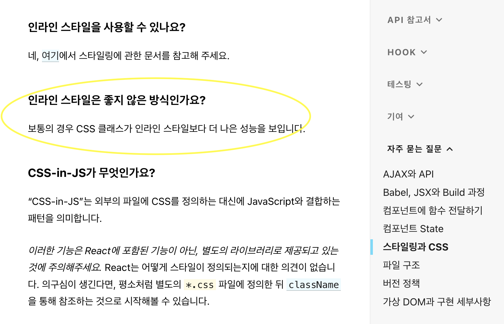

# 0706 (수)

## Ant- design inline-style로 작성하면 불필요한 렌더링이 일어나는 문제

Jsx는 React.createElement로 변환되고 모든 속성이 props 객체의 일부가 된다

그러다 보니 style부분의 비교는 항상 false가 나올 수 밖에 없고

```jsx
{} === {} //false
```



다시 렌더링 될 때마다 스타일 객체가 다시 계산되어 성능이 저하된다.

리액트 공식문서, why did you rendered 공식문서 등 일반적으로 추천하지 않는 방법이다.
styled components에서는 이렇게 바꿔야한다

```jsx
import styled from "styled-components"

import { 뭐시기 } from "antd";

export default function App() {
	return (
    	<스타일먹인 뭐시기 />
    );
}

const 스타일먹인 뭐시기 = styled(뭐시기)`
color : 빨강빨강;
    background-color : 초록초록;
	`;
```

왜 이방법이 안먹히지 했는데 스타일먹인 뭐시기를 소문자로 써서 그렇다.

사용자 정의 컴포넌트는 반드시 대문자로 시작해야하는 것을 잊지말자!

### 참고

[react로 ant design 시작하기](https://studioplug.tistory.com/375)
